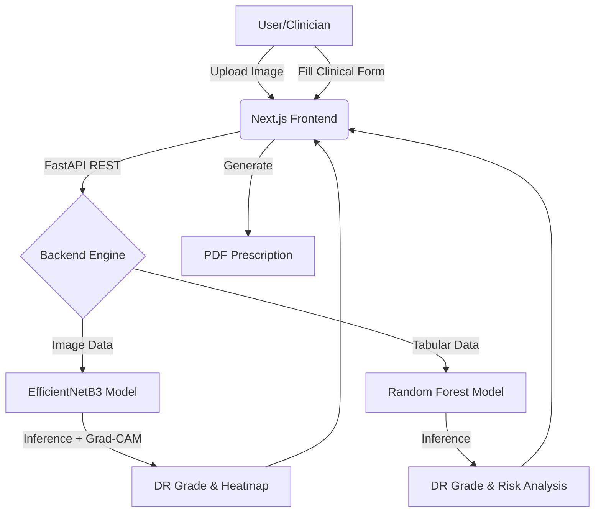

# 👁️ RetinaAI — Diabetic Retinopathy Detection System

<div align="center">

[](https://nextjs.org/)
[](https://fastapi.tiangolo.com/)
[](https://tensorflow.org/)
[](https://scikit-learn.org/)
[](https://python.org/)
[](LICENSE)

**A state-of-the-art dual-AI engine for Diabetic Retinopathy (DR) screening — combining Deep Learning on fundus images with Ensemble Machine Learning on clinical features.**

[🔬 Image Analysis](#-image-analysis) · [🩺 Clinical Assessment](#-clinical-assessment) · [� Prescription Generator](#-prescription-generator) · [📖 Research & Models](#-the-models)

</div>

---

## � Root Cause & The Problem

**Diabetic Retinopathy (DR)** is a diabetes complication caused by damage to the blood vessels of the light-sensitive tissue at the back of the eye (retina). It is a leading cause of vision loss globally.

### The Challenge:
- **Delayed Diagnosis**: Early stages (Mild/Moderate) are often asymptomatic, meaning patients only seek help when vision loss is irreversible.
- **Specialist Scarcity**: Manual screening of fundus images requires trained ophthalmologists, who are often unavailable in rural or underserved areas.
- **Resource Constraints**: Traditional clinical screening involves multiple tests (HbA1c, Blood Pressure, BMI, etc.) that may be overlooked without a centralized triage system.

---

## 🎯 Our Proposed Solution: RetinaAI

RetinaAI provides a **multi-modal AI framework** to bridge the screening gap. By providing both image-based and data-driven analysis, it empowers primary care physicians to identify high-risk patients early.

### The "Dual-Engine" Approach:
1.  **Vision Engine**: Analyzes retinal fundus photographs to detect early lesions (microaneurysms, hemorrhages).
2.  **Clinical Engine**: Analyzes 24+ patient health metrics to predict DR risk even when high-quality imaging isn't available.

---

## ✨ Key Features

-   **Dual-Inference Pipeline**: Independent image and clinical models for 360-degree patient assessment.
-   **Grad-CAM Explainability**: Visual heatmaps highlighting lesions that the AI identified, building clinical trust.
-   **Automated Prescription Generator**: Instantly generates printable professional medical prescriptions based on AI findings.
-   **ICDR Grading**: Full alignment with the *International Clinical Diabetic Retinopathy* severity scale (Grades 0 to 4).
-   **Responsive Dashboard**: Premium dark-mode interface with glassmorphic design and smooth animations.
-   **Real-time Analytics**: Probability breakdown for each DR stage with clinical follow-up recommendations.

---

## 🧠 The Models: Why & How

### 1. Image Model: EfficientNetB3
**Why EfficientNetB3?**
We selected **EfficientNetB3** for its exceptional balance between accuracy and computational efficiency. Compared to ResNet or VGG, B3 uses "Compound Scaling" which uniformly scales depth, width, and resolution, making it ideal for detecting the fine, granular details of retinal lesions (like microaneurysms) without requiring massive server clusters.

**How it works:**
-   **Input**: 224×224 RGB fundus image.
-   **Preprocessing**: Applied **CLAHE** (Contrast Limited Adaptive Histogram Equalization) to normalize illumination across different fundus cameras.
-   **Transfer Learning**: Pre-trained on ImageNet and fine-tuned in two stages (Freezing base → Unfreezing top 30 layers).
-   **Augmentation**: Uses *albumentations* for realistic variations in brightness, noise, and rotation to improve robustness.

### 2. Clinical Model: Random Forest (Ensemble)
**Why Random Forest?**
Clinical data is often non-linear and contains outliers. **Random Forest** was chosen because it is an ensemble of 500 decision trees that effectively handles small patient datasets (300+ records) without overfitting. It also provides **Feature Importance**, allowing us to see how variables like *HbA1c* and *Diabetes Duration* impact the prediction.

**How it works:**
-   **Features**: 24 engineered features (MAP, Pulse Pressure, VA Scores, etc.).
-   **Triage**: Acts as a first-line screening tool for clinics without fundus cameras.
-   **Probability**: Provides a soft-voting confidence interval across all 5 DR stages.

---

## 🏗️ Technical Architecture & Workflow



1.  **Preprocessing**: Images are cropped to circular ROI and enhanced; clinical data is normalized via StandardScaler.
2.  **Inference**: Models run in parallel on the FastAPI backend (Python 3.12).
3.  **Explainability**: The system generates a gradient-weighted class activation map (Grad-CAM) to explain its "thinking."
4.  **Reporting**: Frontend logic maps the predicted grade to standard clinical actions.

---

## 🗂️ Project Structure

```
diabetic-retinopathy-detection/
│
├── backend/                        # FastAPI Python backend
│   ├── server.py                   # Main API server (endpoints)
│   ├── diabetic_retinopathy_model.py  # EfficientNetB3 + Grad-CAM class
│   ├── train_clinical_model.py     # Random Forest training script
│   ├── requirements.txt            # Python dependencies
│   └── models/                     # Model weights (not in git — see below)
│       ├── dr_model_best.keras     # EfficientNetB3 weights (~55MB)
│       ├── dr_clinical_model.joblib  # Random Forest model
│       ├── dr_scaler.joblib        # Feature scaler
│       └── dr_model_metadata.json  # Feature names, metrics, class info
│
├── app/                            # Next.js App Router pages
│   ├── page.tsx                    # Home / Landing page
│   ├── analyze/page.tsx            # Image Analysis page
│   ├── clinical/page.tsx           # Clinical Assessment form
│   ├── report/page.tsx             # Prescription Generator
│   ├── about/page.tsx              # Model info & ICDR scale
│   ├── layout.tsx                  # Root layout + metadata
│   └── globals.css                 # Global styles + animations
│
├── components/
│   └── Navbar.tsx                  # Shared navigation bar
│
├── public/                         # Static assets
├── package.json
├── tsconfig.json
└── README.md
```

---

## 🚀 Getting Started

### Prerequisites
- **Python 3.10–3.12**
- **Node.js 18+** and **npm**
- **Git**

---

### 1️⃣ Clone the repository

```bash
git clone https://github.com/LAKSHMINARASIMHATM/diabetic-retinopathy-detection.git
cd diabetic-retinopathy-detection
npm install
npm run dev
```

### 2. Backend Setup (Windows)
```bash
cd backend

# Create virtual environment
python -m venv venv

# Activate (Windows)
.\venv\Scripts\activate
pip install -r requirements.txt
```

#### ⚠️ Download Model Weights

The trained model weights are too large for GitHub. Download them separately:

| File | Description | Size |
|---|---|---|
| `dr_model_best.keras` | EfficientNetB3 weights | ~55 MB |
| `dr_clinical_model.joblib` | Random Forest model | ~5 MB |
| `dr_scaler.joblib` | StandardScaler | <1 MB |

Place them in `backend/models/`.

**Or retrain from scratch:**
```bash
# Train the clinical Random Forest model
python train_clinical_model.py

# Train the image model (requires APTOS/EyePACS dataset)
# See diabetic_retinopathy_model.py for training setup
```

#### ▶️ Start the Backend

```bash
uvicorn server:app --reload --port 8000
```

API docs available at: **[http://localhost:8000/docs](http://localhost:8000/docs)**

---

### 3️⃣ Frontend Setup

```bash
# From the project root
npm install
npm run dev
```

App available at: **[http://localhost:3000](http://localhost:3000)**

---

## 🌐 API Endpoints

| Method | Endpoint | Description |
|---|---|---|
| `GET` | `/health` | Health check — model load status |
| `POST` | `/predict` | Image inference (multipart/form-data) |
| `POST` | `/predict-clinical` | Clinical inference (JSON body) |
| `GET` | `/model-metadata` | Clinical model feature info & metrics |
| `GET` | `/docs` | Interactive Swagger UI |

### Example — Image Prediction
```bash
curl -X POST http://localhost:8000/predict \
  -F "file=@retinal_image.jpg"
```

### Example — Clinical Prediction
```bash
curl -X POST http://localhost:8000/predict-clinical \
  -H "Content-Type: application/json" \
  -d '{
    "age": 55,
    "diabetes_duration": 10,
    "hba1c": 8.2,
    "systolic_bp": 140,
    "diastolic_bp": 88,
    "bmi": 28.5,
    "cholesterol": 210,
    "iop": 17,
    "va_right": "20/40",
    "va_left": "20/30",
    "gender": "Male",
    "ethnicity": "Asian",
    "diabetes_type": "Type 2",
    "smoking": "Former",
    "kidney_disease": "No",
    "neuropathy": "Yes",
    "eye_side": "Both",
    "has_symptom": true
  }'
```

---

## 📄 Pages

### 🏠 Home
Landing page with feature overview, DR severity scale, model statistics, and links to all tools.

### 🔬 Image Analysis Page
- Drag-and-drop or click-to-upload retinal fundus photograph
- Real-time inference with EfficientNetB3
- **Grad-CAM heatmap** toggle — visualizes model attention on retinal lesions
- Per-class probability bars with severity color coding
- Clinical recommendation based on predicted grade

### 🩺 Clinical Assessment Page
- Structured form with 5 sections: Demographics, Diabetes Info, Vital Signs, Ophthalmic, Comorbidities
- 24 features fed to the Random Forest model
- Identified risk factors displayed with probability breakdown
- Follow-up recommendation

### 📋 Prescription Generator
- Enter patient name, age, gender, MRN, doctor, hospital
- Select DR grade from AI results
- Generates a **printable medical prescription** with:
  - Diagnosis summary
  - Medications with dosage & purpose
  - Eye drops / intravitreal injections (for severe grades)
  - Investigations advised
  - Lifestyle & dietary advice
  - Auto-calculated follow-up date
- **Print / Save as PDF** via browser

### ℹ️ About
- EfficientNetB3 & Random Forest architecture comparison
- 6-step image analysis pipeline diagram
- 24 clinical features breakdown
- Full ICDR grading reference (Grade 0–4) with clinical features and recommended actions

---

## 🎨 Tech Stack

| Layer | Technology |
|---|---|
| **Frontend** | Next.js 15, React 19, TypeScript |
| **Styling** | Vanilla CSS, Tailwind CSS v4, Glassmorphism |
| **Icons** | Lucide React |
| **Backend** | FastAPI, Uvicorn, Pydantic |
| **Image Model** | TensorFlow/Keras, EfficientNetB3 |
| **Clinical Model** | scikit-learn, Random Forest |
| **Image Processing** | OpenCV, Albumentations, Pillow |
| **Explainability** | Grad-CAM (gradient-weighted class activation maps) |

---

## 📊 DR Severity Scale (ICDR)

| Grade | Name | Key Features | Action |
|---|---|---|---|
| **0** | No DR | No abnormalities | Annual screening |
| **1** | Mild NPDR | Microaneurysms only | 12-month follow-up |
| **2** | Moderate | Hemorrhages, exudates | 3-6 month referral |
| **3** | Severe | 4-2-1 rule met | 1-3 month urgent referral |
| **4** | Proliferative| Neovascularization | **Immediate** laser/injection |

---

## ⚠️ Medical Disclaimer
This software is intended for **research and educational assistance** and is not a substitute for professional medical diagnosis. Decisions regarding patient care should always be made by a qualified healthcare professional.

---

<div align="center">

Made with ❤️ by [LAKSHMINARASIMHATM](https://github.com/LAKSHMINARASIMHATM)

**[Visit Repository](https://github.com/LAKSHMINARASIMHATM/diabetic-retinopathy-detection)**

</div>
